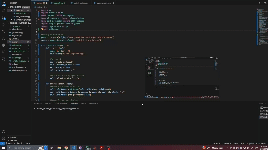
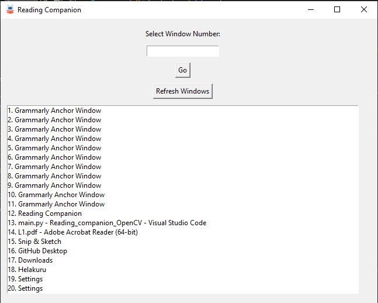
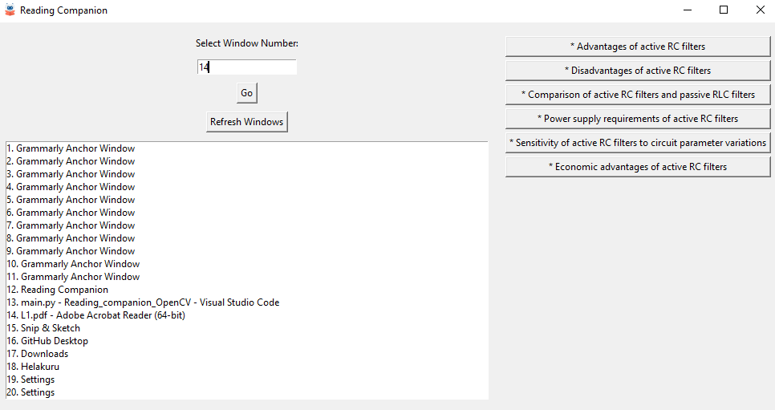
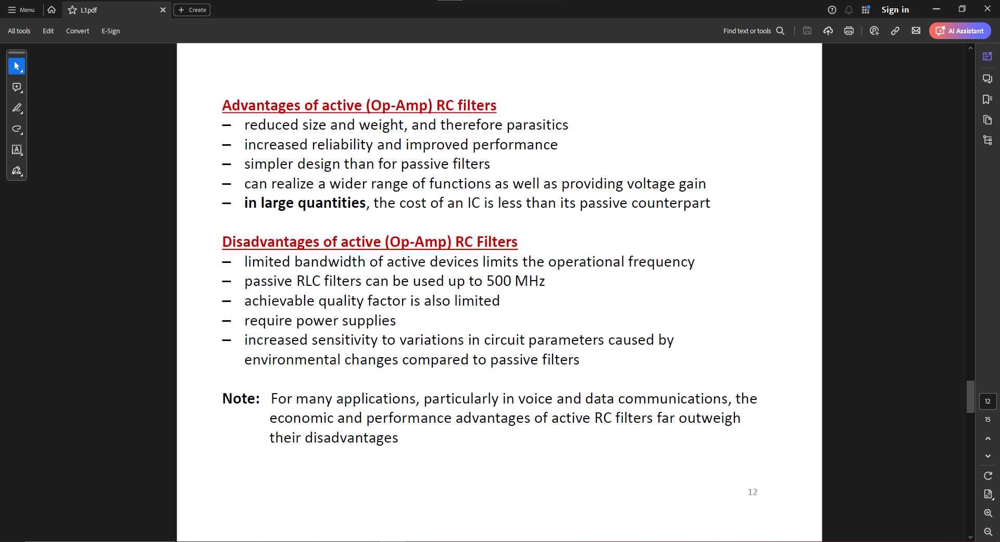
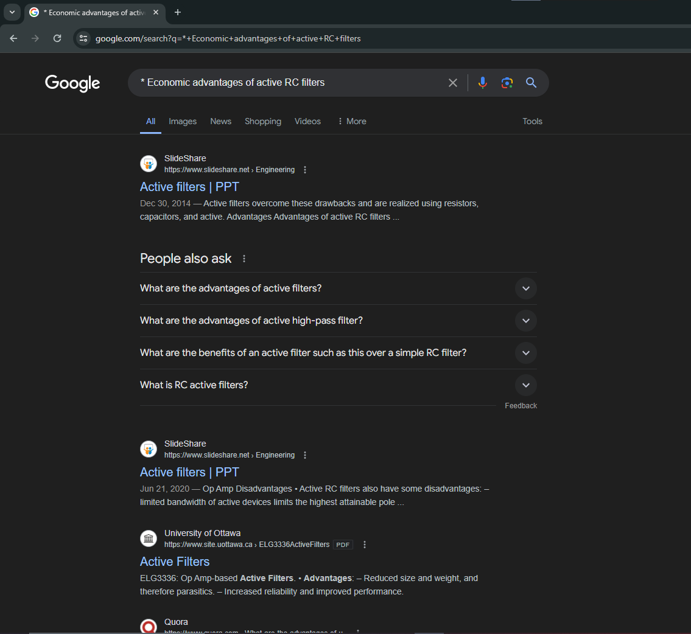

# Reading Companion- CV based OCR application with Gemini Integration

This is a simple yet powerful application that uses Optical Character Recognition (OCR) and Computer Vision to detect open windows, extract their content, filter the text, and suggest important phrases to search on Google using Gemini API integration. The application is useful in various scenarios, such as reading PDFs or attending lectures, by highlighting key points and providing one-click Google search functionality.

<!--
<p align="center">
  
</p> 
-->

## Table of Contents

- [How to Use It](#how-to-use-it)
- [Used Technologies](#used-technologies)
- [Features](#features)
- [Installation](#installation)
- [Screenshots](#screenshots)
- [Contributing](#contributing)
- [License](#license)

## How to Use It

1. **Download and extract the files**:
    - Clone the repository or download the `file.zip` file from GitHub and extract it.
    - Navigate to the directory where the files are located.

2. **Run the application**:
    - Execute the `main.py` script to start the application.
    ```sh
    python main.py
    ```

3. **Using the application**:
    - A window will open displaying a list of currently opened windows.
    - Enter the number corresponding to the window you want to capture and click "Go".
    - The application will display important phrases detected from the window content. Click any phrase to automatically search it on Google.

    **Simple as that!**

## Used Technologies

- **Computer Vision**: For capturing and processing window screenshots.
- **OCR (Optical Character Recognition)**: To extract text from images using Tesseract.
- **AI Technology - Gemini API Integration**: To analyze extracted text and suggest important phrases for Google search.

## Features

- **Capture Open Windows**: Lists and captures screenshots of currently open windows.
- **OCR Extraction**: Extracts text from captured window screenshots.
- **AI-Powered Text Analysis**: Uses Gemini API to analyze text and suggest important search phrases.
- **One-Click Google Search**: Provides a simple GUI to search suggested phrases on Google with one click.
- **Always on Top**: Keeps the application window always on top for easy access.

## Installation

1. **Clone the repository**:
    ```sh
    git clone https://github.com/Sajitha-Madugalle/Reading_Companion_OpenCV.git
    cd Reading_Companion_OpenCV
    ```

2. **Install dependencies**:
    Ensure you have Python installed, then install the required packages using:
    ```sh
    pip install -r requirements.txt
    ```

3. **Configure Tesseract**:
    - Download and install Tesseract OCR from [here](https://github.com/tesseract-ocr/tesseract).
    - Ensure the Tesseract executable path is correctly set: Mostly in
    ```python
    pytesseract.pytesseract.tesseract_cmd = r'C:\Program Files\Tesseract-OCR\tesseract.exe'
    ```

4. **Run the application**:
    ```sh
    python main.py
    ```

## Screenshots

<!-- Include screenshots showing:
1. The main window of the application listing open windows.
2. Selecting a window and capturing its screenshot.
3. Displaying important phrases and searching on Google.
4. Any error messages or important notifications. -->

<!-- First image alone -->
<p align="center">
  
  <br>
  <em>First Window showing the currently opened windows</em>
</p>

&nbsp;
&nbsp;
&nbsp;
&nbsp;

<!-- Second and third images as side-by-side subfigures -->
<p align="center">

  
&nbsp; &nbsp; &nbsp; &nbsp;
  
  <br>
  <em>Selected window and important phrases to search suggested by Gemini</em>
</p>

&nbsp;
&nbsp;
&nbsp;
&nbsp;

<!-- Fourth image alone -->
<p align="center">
  
  <br>
  <em>Google Search Results</em>
</p>

&nbsp;
&nbsp;
&nbsp;
&nbsp;

## Contributing

Contributions are welcome! 

### Problems

- Refresh rate and FPS tradeoff
- Improved GUI
- It is great if there is an floating icon to openup the window, so the reader is not get distracted.
- Applying Deep Learning algorithms to identify Maths phrases, and solve them

Please feel free to submit a Pull Request or open an Issue to improve this project.

1. Fork the repository.
2. Create your feature branch:
    ```sh
    git checkout -b feature/YourFeature
    ```
3. Commit your changes:
    ```sh
    git commit -m 'Add your feature'
    ```
4. Push to the branch:
    ```sh
    git push origin feature/YourFeature
    ```
5. Open a Pull Request.

## License

This project is licensed under the MIT License. See the [LICENSE](LICENSE) file for details.

## References
1. Fast Window Capture - OpenCV Object Detection in Games #4 [See here](https://youtu.be/WymCpVUPWQ4?si=stnlFkPsGhF7rQno).
    by [Learn Code By Gaming](https://www.youtube.com/@LearnCodeByGaming)
2. Realtime Text Detection in Images using Tesseract | OpenCV | Python | Tutorial for beginners [See here](https://youtu.be/Y7XBsFzByTQ?si=1y1tvC6NHxluWbZD).
    by [DeepLearning_by_PhDScholar](https://www.youtube.com/channel/UCUv49cJ3xwr1NXxl9qIJ7kA)
